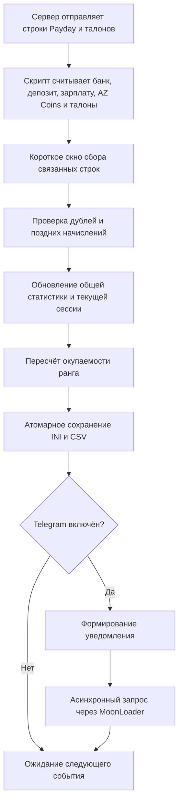

<div align="center">

# 💸 Arizona Payday Clean

### MoonLoader-скрипт для автоматического учёта Payday, доходов и окупаемости ранга на Arizona RP

[](#)
[](#)
[](#)
[](#)

**Русский** · [English](README_EN.md)

</div>

> [!NOTE]
> Иногда самые полезные проекты появляются не из желания сделать что-то большое, а из желания перестать делать одну и ту же вещь каждый день.

---

## 📌 О проекте

**Arizona Payday Clean** — бесплатный MoonLoader-скрипт для Arizona RP, который:

- автоматически считывает данные после Payday;
- ведёт общую статистику и историю Payday;
- рассчитывает окупаемость купленного ранга;
- показывает банк, депозит, AZ Coins и талоны AZ Coins;
- отправляет отчёты и отвечает на команды Telegram-бота;
- восстанавливает статистику из резервных копий и CSV;
- безопасно проверяет обновления через GitHub Releases;
- продолжает работать, когда игра свёрнута;
- снижает фоновую нагрузку на процессор в версии 2.0.20.

| Параметр | Значение |
|---|---|
| **Автор** | Artty |
| **Версия** | 2.0.20 |
| **Платформа** | MoonLoader / SA:MP / Arizona RP |
| **Распространение** | Бесплатно |
| **Основной файл** | `ArizonaPaydayClean.lua` |
| **Конфигурация** | `moonloader/config/ArizonaPaydayClean.ini` |
| **История** | `moonloader/config/ArizonaPaydayHistory.csv` |

---

<details open>
<summary><strong>👤 Немного от автора</strong></summary>

<br>

Привет.

Если ты открыл этот репозиторий, скорее всего, тебя заинтересовал либо сам скрипт, либо мой GitHub.

Сразу хочу сказать одну вещь.

Этот проект никогда не создавался как «идеальный» MoonLoader-скрипт, который должен удивлять красивым интерфейсом, необычными анимациями или огромным количеством настроек. Здесь нет цели впечатлить кого-то дизайном.

Он создавался для одного человека — для меня.

Мне хотелось, чтобы скрипт просто работал. Без лишнего. Стабильно. Делал то, ради чего был написан, и не требовал постоянного внимания.

Поэтому где-то код может показаться простым, где-то не самым элегантным, а интерфейс — слишком обычным. Это осознанный выбор. Для меня функциональность всегда была важнее красивой картинки.

</details>

---

## 🎯 Почему появился этот проект

Сейчас я уже не провожу в игре столько времени, сколько когда-то.

Работа занимает большую часть дня. Есть семья. Есть тренировки. Есть обычная жизнь, которой хочется уделять внимание.

Поэтому мой игровой процесс выглядит довольно скучно:

```text
Покупаю ранг → запускаю игру → сворачиваю окно → оставляю персонажа в AFK
```

Через некоторое время захотелось понимать:

- сколько уже заработано;
- окупился ли ранг;
- сколько осталось до полной окупаемости;
- какой был множитель зарплаты;
- сколько пришло на депозит;
- сколько было получено AZ Coins;
- и получать всё это сразу в Telegram, не разворачивая игру.

Так и появился **Arizona Payday Clean**.

---

## ✨ Возможности

<table>
<tr>
<td width="50%" valign="top">

### 📊 Статистика

- автоматическое определение Payday;
- текущий баланс банка;
- текущая сумма на депозите;
- зарплата за последний Payday;
- доход с депозита;
- отдельный учёт AZ Coins;
- отдельный учёт талонов AZ Coins;
- количество Payday;
- общий доход;
- статистика текущей сессии;
- история в `ArizonaPaydayHistory.csv`;
- восстановление данных из резервных копий.

</td>
<td width="50%" valign="top">

### 📈 Окупаемость

- цена купленного ранга;
- зарплата x1;
- определение множителя;
- учёт депозита;
- возвращённая сумма;
- оставшаяся сумма;
- оставшиеся Payday;
- примерное время окупаемости.

</td>
</tr>
<tr>
<td width="50%" valign="top">

### 🖥 Интерфейс

- главное окно на `mimgui`;
- компактное мини-окно;
- отдельные вкладки Telegram, аналитики и обновлений;
- сохранение параметров;
- фиксированное мини-окно без конфликта курсора;
- адаптивная частота фонового цикла;
- работа в свёрнутой игре.

</td>
<td width="50%" valign="top">

### 📬 Telegram

- автоматический отчёт после Payday;
- тестовое сообщение;
- включение и отключение уведомлений;
- команды `/status`, `/stats`, `/today`, `/rank`, `/history` и другие;
- доступ только для сохранённого `chat_id`;
- асинхронная очередь запросов;
- long polling без постоянных коротких запросов;
- защита от устаревших ответов;
- отсутствие внешних процессов.

</td>
</tr>
</table>

---

## ⚡ Что нового в версии 2.0.20

Версия **2.0.20** посвящена снижению нагрузки на компьютер при работе GTA в фоне.

- главный цикл больше не выполняет всю служебную обработку через `wait(0)` каждый кадр;
- используется адаптивная задержка:
  - около **10 мс**, когда открыто главное окно;
  - около **50 мс**, когда игра активна;
  - около **250 мс**, когда GTA свёрнута;
- мини-окно не рисуется, когда игра неактивна;
- расчёты мини-окна кэшируются;
- Telegram использует long polling до 20 секунд;
- обработка Payday и талонов остаётся событийной;
- сохранены исправления поздних начислений, истории, восстановления данных и защиты от дублей;
- старый `ArizonaPaydayClean.ini` и CSV-история остаются совместимыми.

> [!IMPORTANT]
> Реальную загрузку CPU можно окончательно проверить только внутри GTA. Для честного сравнения оставь одинаковый FPS-limit и сравни процесс `gta_sa.exe` через минуту после сворачивания игры.

### Основные исправления 2.0.19

- строгий разбор количества талонов после символа `+`;
- баланс талонов берётся из `(N шт.)`;
- обычные AZ Coins не смешиваются с талонами;
- два настоящих одинаковых начисления подряд не должны теряться;
- одно уведомление из Chat, GameText и TextDraw не считается несколько раз;
- поздние зарплата, депозит, AZ и талоны дописываются в последний Payday;
- одиночная строка банковского чека не создаёт пустой Payday;
- диагностические сообщения о талонах выводятся только при включённом debug;
- снижено количество конфликтов курсора и лишних сохранений.

---

## 📱 Что приходит в Telegram

После Payday уведомление может содержать:

```text
💰 Зарплата
⚡ Определённый множитель
🏦 Доход с депозита
📊 Общий доход за Payday
💳 Текущий баланс банка
🏧 Текущую сумму на депозите
🪙 Баланс AZ Coins
🎟 Полученные талоны AZ Coins
📈 Прогресс окупаемости ранга
⏳ Оставшуюся сумму и количество Payday
🕒 Время последней серверной строки
```

---

## 🚀 Установка

### Требования

- GTA San Andreas;
- SA:MP или совместимая сборка Arizona RP;
- MoonLoader;
- `mimgui`;
- `lib.samp.events`;
- `inicfg`;
- стандартные библиотеки MoonLoader.

### Установка скрипта

1. Полностью закрой GTA.
2. Скачай `ArizonaPaydayClean.lua` из раздела **Releases**.
3. Убедись, что в `moonloader` нет второй версии этого скрипта.
4. Помести файл в папку:

```text
moonloader
```

5. Не удаляй `moonloader/config/ArizonaPaydayClean.ini`.
6. Не удаляй `moonloader/config/ArizonaPaydayHistory.csv`.
7. Запусти игру.
8. После загрузки введи:

```text
/payday
```

> [!IMPORTANT]
> Настройки и статистика сохраняются локально в `moonloader/config/ArizonaPaydayClean.ini`.

---

## ⌨️ Команды

| Команда | Назначение |
|---|---|
| `/payday` | Открыть или закрыть главное окно |
| `/paycalc` | Альтернативная команда открытия окна |
| `/paystats` | Показать статистику текущей сессии |
| `/payhistory` | Показать последние записи Payday |
| `/payrecover` | Восстановить доступные данные из резервных копий и CSV |
| `/paydebug` | Включить или выключить диагностический лог |
| `/paywatch` | Включить или выключить контроль пропущенного Payday |
| `/paymini` | Показать или скрыть мини-окно |
| `/paymini on` / `/paymini off` | Явно включить или выключить мини-окно |
| `/paytg TOKEN CHAT_ID` | Сохранить Telegram token и chat ID |
| `/paytgtest` | Отправить тестовый отчёт |
| `/paytgon` | Включить Telegram-уведомления |
| `/paytgoff` | Выключить Telegram-уведомления |
| `/paybot` | Включить или выключить команды Telegram-бота |
| `/paytgcommands` | Обновить меню команд Telegram-бота |
| `/payupdate` | Проверить и установить обновление |
| `/payupdate rollback` | Восстановить предыдущую версию Lua-файла |
### Пример настройки

```text
/paytg 1234567890:AAExampleBotTokenExample 123456789
```

Для группы или канала `chat_id` может быть отрицательным:

```text
/paytg 1234567890:AAExampleBotTokenExample -1001234567890
```

> [!CAUTION]
> Никогда не публикуй настоящий bot token в Issues, скриншотах, логах или открытом репозитории.

---

## 🤖 Настройка Telegram

1. Создай бота через **BotFather**.
2. Получи bot token.
3. Напиши созданному боту любое сообщение.
4. Узнай свой `chat_id`.
5. В игре выполни:

```text
/paytg TOKEN CHAT_ID
```

6. Проверь отправку:

```text
/paytgtest
```

### Команды Telegram-бота

| Команда | Назначение |
|---|---|
| `/start` / `/help` | Справка |
| `/status` / `/ping` | Статус игры, Payday и последней строки сервера |
| `/stats` | Общая статистика |
| `/today` | Статистика за текущую дату |
| `/rank` | Окупаемость ранга |
| `/history N` | Последние записи Payday |
| `/watch` | Состояние контроля Payday |
| `/settings` | Текущие переключатели |
| `/version` | Установленная версия |

Удалённое управление персонажем и изменение игровых настроек через Telegram отключены.

### Где хранятся данные

Bot token и `chat_id` **не зашиты в Lua-файл**.

Они сохраняются только локально:

```text
moonloader/config/ArizonaPaydayClean.ini
```

Рекомендуемый `.gitignore`:

```gitignore
**/ArizonaPaydayClean.ini
**/ArizonaPaydayTelegramResponse_*.json
moonloader.log
```

---

## 🧩 Как работает скрипт



---

## 🛠 Трудности разработки

<details>
<summary><strong>1. Вылет игры при свёрнутом окне</strong></summary>

<br>

Самая неприятная проблема появилась во время разработки Telegram-уведомлений.

Первая реализация запускала `curl.exe` из MoonLoader. Позже использовался запуск внешнего процесса через Windows API и `CreateProcessA`.

В обычном состоянии это могло работать, но сочетание:

- свёрнутой GTA;
- активного anti-AFK;
- получения Payday;
- запуска внешнего процесса;
- ожидания сетевого ответа;

могло полностью закрыть игру без обычной Lua-ошибки в `moonloader.log`.

В итоге от запуска внешних программ пришлось отказаться полностью.

Текущая версия использует встроенный асинхронный загрузчик MoonLoader:

```lua
downloadUrlToFile(...)
```

Теперь скрипт:

- не запускает `curl.exe`;
- не запускает PowerShell;
- не создаёт BAT-файлы;
- не использует CMD;
- не вызывает `CreateProcessA`;
- не блокирует игровой поток;
- продолжает работать при свёрнутой игре.

</details>

<details>
<summary><strong>2. Telegram и русский текст</strong></summary>

<br>

Игра и многие компоненты SA:MP используют CP1251, а Telegram ожидает UTF-8.

Поэтому пришлось отдельно обрабатывать:

- преобразование в UTF-8;
- URL-кодирование;
- переносы строк;
- специальные символы;
- ответ Telegram API.

Без этого русский текст мог приходить повреждённым или запрос мог быть отклонён.

</details>

<details>
<summary><strong>3. Повторное считывание одного Payday</strong></summary>

<br>

Сервер может отправлять несколько строк банковского чека подряд.

Если каждую строку считать отдельным Payday, статистика увеличится несколько раз. Если завершить обработку слишком рано, часть данных — например, депозит или AZ Coins — ещё не успеет прийти.

Для этого используется отложенное завершение и защита от повторного учёта.

</details>

<details>
<summary><strong>4. Разные формулировки серверных сообщений</strong></summary>

<br>

Одинаковая информация может приходить в разных формулировках:

- «Текущая сумма в банке»;
- «Сумма в банке»;
- «Банковский счёт».

Скрипт проверяет несколько вариантов. Если сервер полностью изменит формат Payday, обработчики придётся обновить.

</details>

<details>
<summary><strong>5. Большие игровые суммы</strong></summary>

<br>

Некоторые значения могут превышать диапазон стандартного 32-битного целого числа.

Поэтому отдельные поля обрабатываются как строки и Lua-числа, а не только через стандартный `InputInt`.

</details>

<details>
<summary><strong>6. Очередь Telegram-запросов</strong></summary>

<br>

Если старый запрос завис, завершился по тайм-ауту или его callback пришёл слишком поздно, он мог повлиять на следующий запрос.

Теперь каждому запросу назначается собственный идентификатор, а устаревшие ответы игнорируются.

</details>

<details>
<summary><strong>7. Фоновая нагрузка на процессор</strong></summary>

<br>

Ранние версии выполняли обработку Telegram, обновлятора и интерфейса через `wait(0)` в главном цикле.

Это означало, что служебные проверки запускались практически каждый кадр даже тогда, когда GTA была свёрнута.

В версии 2.0.20 используется адаптивная задержка, отключение рендера мини-окна в фоне и более длинный Telegram long polling.

При этом серверные события Payday и талонов продолжают обрабатываться отдельно.

</details>

<details>
<summary><strong>8. Совместимость с другими скриптами</strong></summary>

<br>

Другие MoonLoader-скрипты могут:

- изменять `samp.events`;
- вмешиваться в состояние паузы;
- менять работу курсора;
- использовать собственный anti-AFK;
- перехватывать серверные сообщения.

Абсолютная совместимость с любой сборкой не гарантируется.

</details>

---

## 🐞 Возможные ошибки

Скрипт изначально создавался для личного использования, поэтому в нём могут оставаться ошибки или недоработки.

Если заметил баг, создай **Issue** и укажи:

- что произошло;
- после какого действия;
- была ли игра свёрнута;
- был ли включён anti-AFK;
- были ли включены Telegram-уведомления;
- какие другие MoonLoader-скрипты работали;
- последние строки из `moonloader.log`;
- пример неправильно обработанного серверного сообщения.

### Где искать логи

```text
moonloader/moonloader.log
```

Если `gta_sa.exe` вылетел полностью и Lua-ошибка не записалась:

```text
Просмотр событий Windows → Журналы Windows → Приложение
```

---

## 🔐 Безопасность

Перед публикацией или отправкой файлов проверь, что ты не прикладываешь:

- `ArizonaPaydayClean.ini`;
- `moonloader.log`;
- скриншоты с bot token;
- временные ответы Telegram;
- архив всей папки `moonloader/config`.

> [!TIP]
> В публичном Lua-файле bot token и `chat_id` отсутствуют.

---

## 💬 Почему GitHub?

Этот репозиторий загружен сюда не для рекламы.

И уж точно не потому, что я рассчитываю, что им будут пользоваться тысячи игроков.

Скорее всего, большинство игроков Arizona RP вообще никогда его не увидят. Я специально его нигде не рекламирую, не выкладываю на форумы и не занимаюсь распространением.

Для меня это просто одна из работ, которую я решил оставить открытой.

Основное направление моей деятельности — автоматизация различных процессов, разработка Telegram-ботов, внутренних инструментов и небольших сервисов.

Да, MoonLoader и SA:MP — совсем другая сфера. Но мне всегда было интересно изучать что-то новое. Я не люблю ограничивать себя одной технологией или одним языком программирования. Если появляется интересная задача — я стараюсь разобраться и решить её.

Именно поэтому этот репозиторий находится здесь — как один из примеров моего подхода к разработке.

---

## 🎮 Причём тут вообще SA:MP?

Наверное, потому что некоторые вещи остаются с человеком намного дольше, чем кажется.

Для многих SA:MP — просто старая игра.

Для меня — небольшой этап жизни, который многому научил.

Когда-то давно я был заместителем, а позже и лидером организации на уже не существующем сегодня проекте.

Тогда я впервые столкнулся с тем, что нужно не просто играть, а общаться с людьми, договариваться, разрешать конфликты, принимать решения, брать ответственность и вести за собой команду.

Наверное, именно там я впервые понял, что значит руководить людьми и искать подход к совершенно разным характерам.

Сейчас, спустя годы, я понимаю, что эти навыки пригодились далеко за пределами игры.

Наверное, поэтому SA:MP до сих пор вызывает тёплые воспоминания.

Да и сама Arizona RP уже давно постепенно уходит от классического SA:MP. Новые технологии, собственные решения, свои направления развития — время идёт вперёд.

> Человек может уйти из Arizona RP. Но Arizona RP из человека — уже вряд ли.

Наверное, именно поэтому иногда всё ещё хочется открыть игру, зайти в организацию, оставить персонажа в AFK и просто услышать знакомый звук очередного Payday.

---

## 📦 GitHub Release v2.0.20

Для GitHub Release используй:

```text
Тег: v2.0.20
Название: Arizona Payday Clean v2.0.20
Asset: ArizonaPaydayClean.lua
```

Проверка asset:

```text
Размер: 178384 байт
SHA-256: a6d3565322d9d084376186084614ec94e54aa15a898996f515ea1bdb3bddc453
Кодировка: CP1251
```

Готовое описание релиза находится в `releases/v2.0.20.md`.

---

## 📄 Лицензия

Проект распространяется полностью бесплатно.

Используй, изучай и изменяй под себя, если он оказался полезен.

При публикации изменённой версии будет правильно сохранить упоминание первоначального автора.

---

## ❤️ Спасибо

Спасибо моей семье — за поддержку и понимание.

Спасибо друзьям и людям, которые были рядом в разные периоды жизни.

И отдельное спасибо тем, с кем когда-то пересеклись дороги в SA:MP. Даже если мы уже давно не играем, часть этих воспоминаний навсегда останется с нами.

<div align="center">

### Берегите себя. И удачи во всём, чем бы вы ни занимались.

**Artty**

</div>
