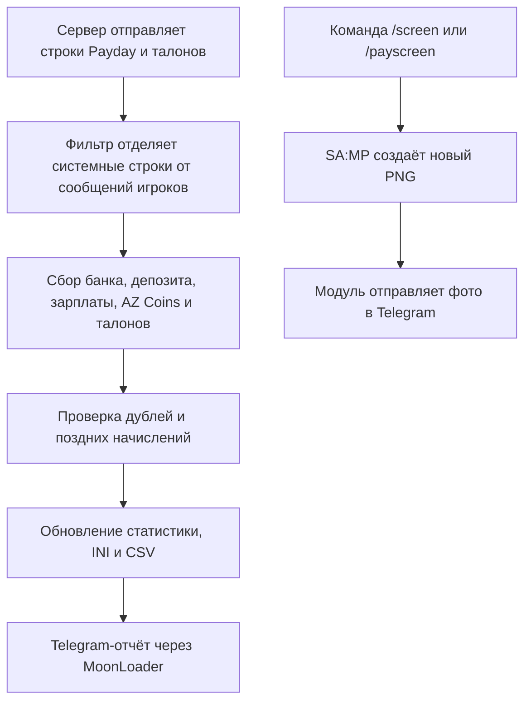

<div align="center">

# 💸 Arizona Payday Clean

### MoonLoader-скрипт для автоматического учёта Payday, доходов и окупаемости ранга на Arizona RP

[](#)
[](#)
[](#)
[](#)

**Русский** · [English](README_EN.md)

</div>

> [!NOTE]
> Иногда самые полезные проекты появляются не из желания сделать что-то большое, а из желания перестать делать одну и ту же вещь каждый день.

---

## 📌 О проекте

**Arizona Payday Clean** — бесплатный MoonLoader-скрипт для Arizona RP, который:

- автоматически считывает данные после Payday;
- ведёт общую статистику и CSV-историю;
- рассчитывает окупаемость купленного ранга;
- показывает банк, депозит, AZ Coins и талоны AZ Coins;
- определяет множитель зарплаты;
- отправляет отчёты и отвечает на команды Telegram-бота;
- по команде `/screen` присылает актуальный скриншот GTA в Telegram;
- восстанавливает статистику из резервных копий;
- безопасно проверяет обновления через GitHub Releases;
- продолжает работать, когда GTA свёрнута;
- снижает фоновую нагрузку и корректно завершает работу вместе с игрой.

| Параметр | Значение |
|---|---|
| **Автор** | Artty |
| **Версия** | 2.0.26 |
| **Платформа** | MoonLoader / SA:MP / Arizona RP |
| **Распространение** | Бесплатно |
| **Основной файл** | `ArizonaPaydayClean.lua` |
| **Конфигурация** | `moonloader/config/ArizonaPaydayClean.ini` |
| **История** | `moonloader/config/ArizonaPaydayHistory.csv` |
| **Кодировка Lua-файла** | CP1251 |

---

<details open>
<summary><strong>👤 Немного от автора</strong></summary>

<br>

Привет.

Этот проект никогда не создавался как «идеальный» MoonLoader-скрипт, который должен удивлять анимациями или огромным количеством настроек.

Он создавался для одного человека — для меня.

Мне хотелось, чтобы скрипт просто работал: стабильно учитывал Payday, сохранял данные и не требовал постоянного внимания. Поэтому функциональность здесь важнее красивой картинки.

Репозиторий опубликован бесплатно как пример моего подхода к автоматизации, Telegram-интеграциям и решению практических задач.

</details>

---

## 🎯 Почему появился этот проект

Сейчас я провожу в игре намного меньше времени, чем раньше. Есть работа, семья, тренировки и обычная жизнь.

Поэтому игровой процесс часто выглядит так:

```text
Покупаю ранг → запускаю игру → сворачиваю окно → оставляю персонажа в AFK
```

Хотелось понимать:

- сколько уже заработано;
- окупился ли ранг;
- сколько осталось до полной окупаемости;
- какой был множитель зарплаты;
- сколько пришло на депозит;
- сколько получено AZ Coins и талонов;
- что произошло в игре, не разворачивая её.

Так появился **Arizona Payday Clean**.

---

## ✨ Возможности

<table>
<tr>
<td width="50%" valign="top">

### 📊 Статистика

- автоматическое определение Payday;
- банк и депозит;
- зарплата за последний Payday;
- доход с депозита;
- AZ Coins и талоны AZ Coins;
- количество Payday;
- общий доход;
- статистика текущей сессии;
- история в `ArizonaPaydayHistory.csv`;
- защита от повторного учёта;
- защита финансового парсера от сообщений игроков в VIP, обычном, семейном и других чатах;
- восстановление данных из резервных копий.

</td>
<td width="50%" valign="top">

### 📈 Окупаемость

- номер и цена купленного ранга;
- зарплата x1;
- автоматическое определение множителя;
- опциональный учёт дохода с депозита;
- возвращённая и оставшаяся сумма;
- оставшееся количество Payday;
- примерное время до окупаемости;
- мини-окно с текущим прогрессом.

</td>
</tr>
<tr>
<td width="50%" valign="top">

### 🖥 Интерфейс

- главное окно на `mimgui`;
- компактное мини-окно;
- вкладки статистики, ранга, Telegram, аналитики и обновлений;
- сохранение настроек;
- текстовые поля для больших игровых сумм;
- работа в свёрнутой игре;
- адаптивная частота фонового цикла.

</td>
<td width="50%" valign="top">

### 📬 Telegram

- автоматический отчёт после Payday;
- тестовое сообщение;
- включение и отключение уведомлений;
- команды `/status`, `/stats`, `/today`, `/screen`, `/rank`, `/history` и другие;
- доступ только для сохранённого `chat_id`;
- асинхронная очередь запросов;
- ограниченный по времени polling;
- защита от устаревших callback-ответов;
- удалённый скриншот GTA по команде `/screen`;
- отсутствие `curl.exe`, PowerShell, CMD и других внешних процессов.

</td>
</tr>
</table>

---

## 🚑 Что нового в версии 2.0.26

Версия **2.0.26** добавляет удалённый скриншот GTA через Telegram, не вмешиваясь в существующий учёт Payday.

### Добавлено

- команда Telegram-бота `/screen` — создаёт новый скриншот GTA и отправляет его в сохранённый чат;
- команда в игре `/payscreen` — ручная проверка той же функции;
- автоматический поиск нового PNG-файла в стандартных папках скриншотов SA:MP;
- ограничение на одну задачу скриншота одновременно;
- понятные ответы при неподдерживаемой версии SA:MP, отсутствии файла, тайм-ауте или ошибке Telegram;
- команда `/paytgcommands` теперь добавляет `/screen` в меню Telegram-бота.

### Изоляция и стабильность

- создание и отправка скриншота вынесены в отдельный модуль `ArizonaPaydayScreen.dll`;
- отправка фото выполняется отдельно и не задерживает игру;
- существующая отправка текстовых сообщений, polling бота и обновлятор не переписывались;
- при отсутствии или блокировке DLL отключается только `/screen` — Payday, CSV, INI, Telegram-отчёты, окупаемость и интерфейс продолжают работать;
- при `/q` скрипт просит фоновую задачу остановиться и не ждёт завершения сети;
- `curl.exe`, PowerShell, CMD, BAT-файлы и `CreateProcessA` не используются;
- защита финансового парсера от поддельных сообщений игроков из hotfix 2.0.25 сохранена.

> [!IMPORTANT]
> Для `/screen` нужны **оба файла**: `moonloader/ArizonaPaydayClean.lua` и `moonloader/lib/ArizonaPaydayScreen.dll`. Установка только Lua-файла не ломает основной скрипт, но функция скриншота будет недоступна.

> [!NOTE]
> Некоторые сборки GTA/SA:MP не создают скриншот, когда окно полностью свёрнуто или графическое устройство потеряно. В таком случае бот вернёт ошибку, а статистика останется без изменений.

---

## 🕘 Изменения предыдущих версий

<details>
<summary><strong>Версия 2.0.25 — стабильность, выход через /q и защита чатов</strong></summary>

<br>

- снижена фоновая нагрузка в активной и свёрнутой игре;
- сокращены тайм-ауты и частота Telegram polling;
- добавлен единый безопасный режим завершения работы;
- при `/q` прекращается создание новых запросов, очищаются очереди и сохраняются настройки;
- устранено двойное сохранение конфигурации;
- сообщения игроков формата `Nick_Name[ID]: текст` больше не могут подделать банк, депозит, AZ Coins, зарплату или талоны;
- реальные системные строки Payday продолжают обрабатываться прежней логикой.

</details>

<details>
<summary><strong>Версия 2.0.21 — парсер Payday</strong></summary>

<br>

- исправлена обработка реальных строк банка и депозита с разделителями;
- парсер перестал зависеть от точного положения `$`, пробелов и служебных символов;
- добавлена поддержка временной метки `[HH:MM:SS]`;
- исправлено распознавание строки `Общая заработная плата`;
- усилено распознавание талонов AZ Coins;
- неизвестные значения не подменяются старыми данными в Telegram;
- частичный отчёт не создаётся по единственной случайной строке.

</details>

<details>
<summary><strong>Версии 2.0.19–2.0.20 — талоны, дубли и фон</strong></summary>

<br>

- строгий разбор количества талонов после `+`;
- баланс талонов берётся из `(N шт.)`;
- AZ Coins не смешиваются с талонами;
- уведомления Chat, GameText и TextDraw объединяются;
- поздние начисления дописываются в последний Payday;
- одиночная строка банковского чека не создаёт пустую запись;
- добавлена адаптивная задержка фонового цикла;
- расчёты мини-окна кэшируются.

</details>

---

## 📱 Что приходит в Telegram

После Payday уведомление может содержать:

```text
💰 Зарплату
⚡ Определённый множитель
🏦 Доход с депозита
📊 Общий доход за Payday
💳 Текущий баланс банка
🏧 Текущую сумму на депозите
🪙 Баланс AZ Coins
🎟 Полученные талоны AZ Coins
📈 Прогресс окупаемости ранга
⏳ Оставшуюся сумму и количество Payday
🕒 Время последней серверной строки
```

---

## 🚀 Установка

### Требования

- GTA San Andreas;
- SA:MP или совместимая сборка Arizona RP;
- MoonLoader;
- `mimgui`;
- `lib.samp.events`;
- `inicfg`;
- стандартные библиотеки MoonLoader;

### Установка или обновление

1. Полностью закрой GTA.
2. Открой готовый архив версии 2.0.26.
3. Скопируй файл:

```text
ArizonaPaydayClean.lua → moonloader/ArizonaPaydayClean.lua
```

4. Скопируй модуль скриншотов:

```text
lib/ArizonaPaydayScreen.dll → moonloader/lib/ArizonaPaydayScreen.dll
```

5. Убедись, что в `moonloader` осталась только одна рабочая копия `ArizonaPaydayClean.lua`.
6. Не удаляй:

```text
moonloader/config/ArizonaPaydayClean.ini
moonloader/config/ArizonaPaydayHistory.csv
```

7. Запусти игру и проверь основной скрипт командой `/payday`.
8. Для проверки новой функции введи `/payscreen`, затем попробуй `/screen` в Telegram.

> [!IMPORTANT]
> Встроенный `/payupdate` обновляет Lua-файл. Модуль `ArizonaPaydayScreen.dll` нужно установить вручную хотя бы один раз из полного архива версии 2.0.26.

> [!CAUTION]
> Две версии скрипта в папке `moonloader` могут одновременно обрабатывать один Payday, дублировать уведомления и увеличивать нагрузку.

---

## ⌨️ Команды в игре

| Команда | Назначение |
|---|---|
| `/payday` | Открыть или закрыть главное окно |
| `/paycalc` | Альтернативная команда открытия окна |
| `/paystats` | Показать статистику текущей сессии |
| `/payhistory` | Показать последние записи Payday |
| `/payrecover` | Восстановить данные из резервных копий и CSV |
| `/paydebug` | Включить или выключить диагностический лог |
| `/paywatch` | Включить или выключить контроль пропущенного Payday |
| `/paymini` | Показать или скрыть мини-окно |
| `/paymini on` / `/paymini off` | Явно изменить состояние мини-окна |
| `/payscreen` | Сделать скриншот GTA и отправить его в настроенный Telegram |
| `/paytg TOKEN CHAT_ID` | Сохранить Telegram token и chat ID |
| `/paytgtest` | Отправить тестовый отчёт |
| `/paytgon` | Включить Telegram-уведомления |
| `/paytgoff` | Выключить Telegram-уведомления |
| `/paybot` | Включить или выключить команды Telegram-бота |
| `/paytgcommands` | Обновить меню команд Telegram-бота |
| `/payupdate` | Проверить и установить обновление |
| `/payupdate rollback` | Восстановить предыдущую версию Lua-файла |

### Пример настройки Telegram

```text
/paytg 1234567890:AAExampleBotTokenExample 123456789
```

Для группы или канала `chat_id` может быть отрицательным:

```text
/paytg 1234567890:AAExampleBotTokenExample -1001234567890
```

> [!CAUTION]
> Никогда не публикуй настоящий bot token в Issues, скриншотах, логах или открытом репозитории.

---

## 🤖 Команды Telegram-бота

| Команда | Назначение |
|---|---|
| `/start` / `/help` | Справка |
| `/status` / `/ping` | Статус игры, Payday и последней серверной строки |
| `/stats` | Общая статистика |
| `/today` | Статистика за текущую дату |
| `/screen` | Сделать новый скриншот GTA и прислать его в чат |
| `/rank` | Окупаемость ранга |
| `/history N` | Последние записи Payday |
| `/watch` | Состояние контроля Payday |
| `/settings` | Текущие переключатели |
| `/version` | Установленная версия |

Удалённое управление персонажем через Telegram не используется.

Bot token и `chat_id` не зашиты в публичный Lua-файл. Они сохраняются локально:

```text
moonloader/config/ArizonaPaydayClean.ini
```

Рекомендуемый `.gitignore`:

```gitignore
**/ArizonaPaydayClean.ini
**/ArizonaPaydayTelegramResponse_*.json
**/ArizonaPaydayTelegramUpdates_*.json
moonloader.log
```

---

## 🧩 Как работает скрипт



---

## 🛠 Технические решения

### Без внешних процессов

Скрипт не запускает:

- `curl.exe`;
- PowerShell;
- CMD;
- BAT-файлы;
- `CreateProcessA`.

Текстовые Telegram-сообщения и обновления по-прежнему используют встроенный асинхронный загрузчик MoonLoader:

```lua
downloadUrlToFile(...)
```

За отправку фотографии отвечает `ArizonaPaydayScreen.dll`. Он лежит в папке `lib` и устанавливается один раз вместе с обновлением.

### Изолированный модуль скриншотов

Модуль не хранит token или `chat_id` и получает их только на время одной отправки. Если модуль отсутствует, не загрузился или Telegram отклонил фотографию, изменяется только состояние текущего запроса `/screen`; финансовая статистика не затрагивается.

### Защита от дублей

Сервер может отправлять связанные строки через Chat, GameText и TextDraw. Скрипт объединяет события в коротком окне сбора, проверяет сигнатуры и дописывает поздние начисления в уже созданный Payday.

### Большие суммы

Значения, которые могут превышать диапазон стандартного 32-битного `InputInt`, вводятся как текст и затем безопасно преобразуются в Lua-числа.

### Безопасное завершение

Версия 2.0.26 обрабатывает несколько событий завершения MoonLoader. После начала выхода скрипт закрывает меню, прекращает новые запросы, отменяет задачу скриншота без ожидания, освобождает управление и сохраняет состояние без повторной записи.

---

## 🐞 Возможные ошибки

Скрипт создавался прежде всего для личного использования, поэтому абсолютная совместимость с любой сборкой не гарантируется.

При создании **Issue** укажи:

- что произошло;
- после какого действия;
- была ли GTA свёрнута;
- был ли включён anti-AFK;
- были ли включены Telegram-уведомления и команды бота;
- использовалась ли команда `/screen` и появился ли PNG в папке SA:MP;
- какие другие MoonLoader-скрипты работали;
- последние строки из `moonloader.log`;
- пример неправильно обработанного серверного сообщения.

Лог MoonLoader:

```text
moonloader/moonloader.log
```

Если `gta_sa.exe` завис или закрылся без Lua-ошибки:

```text
Просмотр событий Windows → Журналы Windows → Приложение
```

---

## 🔐 Безопасность

Перед публикацией файлов проверь, что ты не прикладываешь:

- `ArizonaPaydayClean.ini`;
- `moonloader.log`;
- скриншоты с bot token;
- временные JSON-ответы Telegram;
- архив всей папки `moonloader/config`.

Публичный `ArizonaPaydayClean.lua` не содержит bot token и `chat_id`.

---

## 📦 GitHub Release v2.0.26

```text
Тег: v2.0.26
Название: Arizona Payday Clean v2.0.26 — Telegram Screenshot
Основной файл: ArizonaPaydayClean.lua
Модуль: lib/ArizonaPaydayScreen.dll
Готовый архив: ArizonaPaydayClean-v2.0.26.zip
```

Проверка файлов:

```text
ArizonaPaydayClean.lua
Размер: 201861 байт
SHA-256: 95cde9866b0780f65d7e65c3c176ab130bdc9dedeca0485fb2323ab823469184
Кодировка: CP1251

ArizonaPaydayScreen.dll
Размер: 10240 байт
SHA-256: 5c3186cf2d5fc30c8de6e2ac6eaf6897b5eb7010bb58c603d86f63d6d0af0c87
```


---

## 📄 Лицензия

Проект распространяется бесплатно.

Используй, изучай и изменяй под себя. При публикации изменённой версии будет правильно сохранить упоминание первоначального автора.

---

## ❤️ Спасибо

Спасибо моей семье, друзьям и людям, которые были рядом.

Когда-то SA:MP научил меня общаться с разными людьми, договариваться, принимать решения и брать ответственность. Эти навыки пригодились далеко за пределами игры.

> Человек может уйти из Arizona RP. Но Arizona RP из человека — уже вряд ли.

<div align="center">

### Берегите себя. И удачи во всём, чем бы вы ни занимались.

**Artty**

</div>
