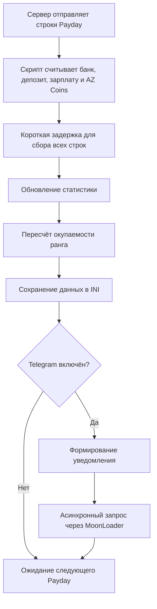

<div align="center">

# 💸 Arizona Payday Clean

### MoonLoader-скрипт для автоматического учёта Payday, доходов и окупаемости ранга на Arizona RP

[](https://github.com/artyom129/Arizona-Payday-Clean)
[](https://github.com/artyom129/Arizona-Payday-Clean/releases/latest)
[](#)
[](https://github.com/artyom129/Arizona-Payday-Clean)

**Русский** · [English](README_EN.md)

<br>

[](https://github.com/artyom129/Arizona-Payday-Clean/releases/latest)

</div>

> [!NOTE]
> Иногда самые полезные проекты появляются не из желания сделать что-то большое, а из желания перестать делать одну и ту же вещь каждый день.

---

## 📌 О проекте

**Arizona Payday Clean** — бесплатный MoonLoader-скрипт для Arizona RP, который:

- автоматически считывает данные после Payday;
- ведёт общую статистику и аналитику текущей сессии;
- сохраняет историю Payday в CSV;
- рассчитывает окупаемость купленного ранга;
- отдельно учитывает обычные AZ Coins и талоны AZ Coins;
- отправляет отчёты и тревоги в Telegram;
- продолжает работать, когда игра свёрнута.

| Параметр | Значение |
|---|---|
| **Автор** | Artty |
| **Версия** | 2.0.15 |
| **Платформа** | MoonLoader / SA:MP / Arizona RP |
| **Распространение** | Бесплатно |
| **Основной файл** | `ArizonaPaydayClean.lua` |
| **Конфигурация** | `moonloader/config/ArizonaPaydayClean.ini` |

---

<details open>
<summary><strong>👤 Немного от автора</strong></summary>

<br>

Привет.

Если ты открыл этот репозиторий, скорее всего, тебя заинтересовал либо сам скрипт, либо мой GitHub.

Сразу хочу сказать одну вещь.

Этот проект никогда не создавался как «идеальный» MoonLoader-скрипт, который должен удивлять красивым интерфейсом, необычными анимациями или огромным количеством настроек. Здесь нет цели впечатлить кого-то дизайном.

Он создавался для одного человека — для меня.

Мне хотелось, чтобы скрипт просто работал. Без лишнего. Стабильно. Делал то, ради чего был написан, и не требовал постоянного внимания.

Поэтому где-то код может показаться простым, где-то не самым элегантным, а интерфейс — слишком обычным. Это осознанный выбор. Для меня функциональность всегда была важнее красивой картинки.

</details>

---

## 🎯 Почему появился этот проект

Сейчас я уже не провожу в игре столько времени, сколько когда-то.

Работа занимает большую часть дня. Есть тренировки. Есть обычная жизнь, которой хочется уделять внимание.

Поэтому мой игровой процесс выглядит довольно скучно:

```text
Покупаю ранг → запускаю игру → сворачиваю окно → оставляю персонажа в AFK
```

Через некоторое время захотелось понимать:

- сколько уже заработано;
- окупился ли ранг;
- сколько осталось до полной окупаемости;
- какой был множитель зарплаты;
- сколько пришло на депозит;
- сколько было получено AZ Coins;
- и получать всё это сразу в Telegram, не разворачивая игру.

Так и появился **Arizona Payday Clean**.

---

## ✨ Возможности

<table>
<tr>
<td width="50%" valign="top">

### 📊 Статистика и история

- автоматическое определение Payday;
- банк, депозит и последний доход;
- общая статистика за всё время;
- статистика текущего запуска;
- средний доход за Payday;
- история последних записей в интерфейсе;
- полный журнал в `ArizonaPaydayHistory.csv`.

</td>
<td width="50%" valign="top">

### 📈 Окупаемость

- цена купленного ранга;
- зарплата x1;
- определение множителя;
- опциональный учёт депозита;
- возвращённая и оставшаяся сумма;
- прогноз Payday и времени;
- перемещаемое мини-окно с сохранением позиции;
- безопасное подтверждение сброса прогресса.

</td>
</tr>
<tr>
<td width="50%" valign="top">

### 🪙 AZ Coins

- отдельный учёт обычных AZ Coins;
- отдельный учёт талонов AZ Coins;
- VIP-талоны не смешиваются с обычным донат-балансом;
- значения попадают в историю и Telegram.

</td>
<td width="50%" valign="top">

### 📬 Telegram и контроль

- премиальные HTML-уведомления;
- плавная полоса окупаемости;
- очередь асинхронных запросов;
- полноценный `/paytgtest`;
- двусторонние команды прямо в Telegram;
- меню команд, автоматически зарегистрированное у бота;
- доступ к командам только из сохранённого `chat_id`;
- контроль пропущенного Payday;
- диагностический лог без внешних процессов.

</td>
</tr>
</table>

---

## 🆕 Что нового в версии 2.0.15

- исправлена точная загрузочная ошибка из `moonloader.log`: `main function has more than 200 local variables`;
- количество локальных переменных в основном блоке снижено с **201 до 194**, ниже жёсткого лимита LuaJIT/MoonLoader;
- параметры интерфейса и мини-окна объединены в таблицы без изменения поведения скрипта;
- итоговый CP1251-файл проверен настоящим LuaJIT через `loadfile()` — скрипт теперь компилируется до запуска;
- сохранено совместимое перемещение мини-окна из 2.0.14: `/paymini` показывает обычный заголовок ImGui.

## Что вошло в версию 2.0.14

- удалены несовместимые ручные вызовы перетаскивания из 2.0.13, из-за которых скрипт мог завершаться в некоторых сборках `mimgui`;
- был возвращён совместимый способ перемещения, но добавление ещё одной локальной настройки превысило лимит LuaJIT; загрузка окончательно исправлена в 2.0.15;
- в режиме `/paymini` у мини-окна теперь появляется обычный заголовок ImGui — за него окно перемещается штатным механизмом без дополнительных API;
- `NoDecoration` и `NoInputs` используются только в пассивном режиме, когда окно не должно мешать игре;
- высота окна в режиме настройки увеличена, чтобы заголовок и кнопка **«Готово»** не перекрывали содержимое;
- позиция сохраняется после **«Готово»**, `ESC` или повторного `/paymini`; `/paymini reset` возвращает стандартные координаты.

## Что вошло в версию 2.0.13

- была добавлена экспериментальная ручная drag-зона;
- из-за несовместимости с игровой сборкой этот способ удалён и заменён штатным заголовком в 2.0.14.

## Что вошло в версию 2.0.12

- добавлен первый вариант режима перемещения с курсором и кнопкой **«Готово»**; в некоторых сборках `mimgui` окно без заголовка всё ещё не двигалось — это исправлено в 2.0.13;
- позиция мини-окна сохраняется в `ArizonaPaydayClean.ini` и восстанавливается после перезапуска;
- окно автоматически возвращается в видимую область после смены разрешения экрана;
- в обычном режиме мини-окно не перехватывает мышь и не мешает управлению персонажем;
- добавлена команда `/paymini` и параметры `reset`, `on`, `off`;
- исправлен резервный подсчёт талонов по изменению баланса: раньше эта ветка кода не могла выполниться;
- усилена защита от повторного учёта одного уведомления из чата, GameText и TextDraw;
- номер версии в интерфейсе и сообщениях теперь берётся из `SCRIPT_VERSION`, без рассинхронизации.

## Что вошло в версию 2.0.11

- исправлена главная причина незачисления талонов: `string.lower()` не переводил кириллицу CP1251, поэтому строка с `Талон` не распознавалась;
- добавлен точный разбор строки `Вам был добавлен предмет Талон: +1 AZ Coins (3 шт.)`;
- талоны отслеживаются не только в серверном чате, но и в GameText, TextDraw и диалогах;
- добавлен общий антидубль между разными источниками уведомления;
- добавлена поддержка 6- и 8-значных цветовых тегов;
- при успешном учёте талона скрипт сразу пишет подтверждение в игровой чат;

## Что вошло в версию 2.0.1

- добавлены двусторонние команды Telegram-бота через `getUpdates`;
- бот отвечает на `/status`, `/stats`, `/today`, `/rank`, `/history`, `/watch` и другие команды;
- добавлены удалённые переключатели контроля Payday и автоматических уведомлений;
- список команд автоматически регистрируется через `setMyCommands`;
- меню команд ограничено сохранённым `chat_id`;
- сообщения из других чатов игнорируются;
- ответы на команды работают даже при выключенных автоматических Payday-уведомлениях;
- добавлены игровые команды `/paybot` и `/paytgcommands`;
- добавлен встроенный JSON-декодер без новых библиотек;
- сохранение `update_offset` защищает от повторного выполнения команд;
- при первом запуске старые накопившиеся обновления не выполняются;
- обработчики команд изолированы через `pcall`, чтобы ошибка ответа не закрыла игру;
- добавлена обработка `retry_after`, тайм-аутов и конфликта с webhook;
- временные файлы `ArizonaPaydayTelegramUpdates_*.json` очищаются после запроса, тайм-аута и завершения скрипта;
- текст истории экранируется перед отправкой в Telegram;
- опрос переведён на long polling, чтобы снизить число запросов.

## Что вошло в версию 2.0.0

- добавлена вкладка **«Аналитика»**;
- добавлена статистика текущего запуска: время, Payday, доход, AZ и талоны;
- добавлена история Payday в `moonloader/config/ArizonaPaydayHistory.csv`;
- обычные AZ Coins и предметы-талоны теперь учитываются отдельно;
- добавлены команды `/paystats` и `/payhistory`;
- добавлен **контроль пропущенного Payday** с необязательной тревогой в Telegram;
- добавлен диагностический режим `/paydebug`;
- добавлена миграция конфигурации 1.7 с резервной копией;
- сброс статистики и окупаемости теперь требует повторного подтверждения;
- исправлена синхронизация Telegram-настроек между командой `/paytg` и интерфейсом;
- исправлено вложенное HTML-форматирование в Telegram;
- добавлена очистка запоздалых временных ответов Telegram;
- сохранены проверенные исправления 1.7: работа в свёрнутой игре, обычные AZ Coins и отсутствие мигания курсора.

## 📱 Что приходит в Telegram

После Payday приходит оформленный отчёт:

```text
💎 ARIZONA PAYDAY
━━━━━━━━━━━━━━━━━━
✅ Начисление успешно

💰 ДОХОД
├ Зарплата: $ 301.515
├ Депозит: $ 229.748
├ Бонус: x1
└ Итого: $ 531.263

🏦 БАЛАНС
├ Банк: $ 15.618.556
├ Депозит: $ 269.659.328
└ AZ Coins: 3.664  +2 AZ

📈 РАНГ №8
3.3%  •  Начало пути
▍░░░░░░░░░░░░░
├ Возвращено: $ ...
├ Осталось: $ 241.859.093
├ Прогноз x1: 803 Payday
└ По текущему доходу: 803 Payday
⌛ Примерно: 16 д. 17 ч.
```

---

## 🚀 Установка

### Требования

- GTA San Andreas;
- SA:MP или совместимая сборка Arizona RP;
- MoonLoader;
- `mimgui`;
- `lib.samp.events`;
- `inicfg`;
- стандартные библиотеки MoonLoader.

### Чистая установка

1. Открой [последний Release](https://github.com/artyom129/Arizona-Payday-Clean/releases/latest).
2. Скачай единственный файл `ArizonaPaydayClean.lua`.
3. В папке `moonloader` оставь только **одну** версию скрипта.
4. Помести файл в папку:

```text
moonloader
```

5. Запусти игру и введи `/payday`.

### Обновление с 1.7

1. Полностью закрой игру.
2. Удали старый Lua-файл, но **не удаляй** `ArizonaPaydayClean.ini`.
3. Положи новую версию в `moonloader`.
4. При первом запуске скрипт сохранит резервную копию:

```text
moonloader/config/ArizonaPaydayClean_v1_backup.ini
```

Настройки Telegram, статистика и прогресс окупаемости сохраняются.

> [!IMPORTANT]
> Не держи 1.7 и 2.0 одновременно: обе версии могут обработать один Payday и зарегистрировать одинаковые команды.

---

## ⌨️ Команды

| Команда | Назначение |
|---|---|
| `/payday` | Открыть или закрыть главное окно |
| `/paycalc` | Альтернативная команда открытия окна |
| `/paystats` | Показать статистику текущего запуска |
| `/payhistory` | Показать последние Payday в игровом чате |
| `/paywatch` | Включить или выключить контроль пропущенного Payday |
| `/paydebug` | Включить или выключить диагностический лог |
| `/paymini` | Включить режим перемещения мини-окна; повторная команда сохраняет позицию |
| `/paymini reset` | Вернуть мини-окно в стандартную позицию |
| `/payupdate` | Проверить наличие новой версии и установить обновление |
| `/paytg TOKEN CHAT_ID` | Сохранить Telegram token и chat ID, затем включить уведомления |
| `/paytgtest` | Отправить полноценный тестовый предпросмотр |
| `/paytgon` | Включить Telegram-уведомления |
| `/paytgoff` | Выключить Telegram-уведомления |
| `/paybot` | Включить или выключить приём команд из Telegram |
| `/paytgcommands` | Повторно зарегистрировать меню команд у бота |

`/payafk` оставлен как совместимый псевдоним для `/paywatch` из beta-версии.

### Пример настройки

```text
/paytg 1234567890:AAExampleBotTokenExample 123456789
```

Для группы или канала `chat_id` может быть отрицательным:

```text
/paytg 1234567890:AAExampleBotTokenExample -1001234567890
```

> [!CAUTION]
> Никогда не публикуй настоящий bot token в Issues, скриншотах, логах или открытом репозитории.

---

## 🤖 Настройка Telegram

1. Создай бота через **BotFather**.
2. Получи bot token.
3. Напиши созданному боту любое сообщение.
4. Узнай свой `chat_id`.
5. В игре выполни:

```text
/paytg TOKEN CHAT_ID
```

6. Проверь отправку:

```text
/paytgtest
```

7. Открой чат с ботом. Через несколько секунд возле поля ввода появится меню команд.

### Команды внутри Telegram

| Команда бота | Действие |
|---|---|
| `/start` или `/help` | Показать справку |
| `/status` | Состояние скрипта, последнего Payday и серверной активности |
| `/stats` | Общая статистика за всё время |
| `/today` | Доход и AZ за текущую дату |
| `/rank` | Текущая окупаемость ранга |
| `/history 5` | Показать от 1 до 10 последних Payday |
| `/watch` | Показать состояние контроля Payday |
| `/watch_on` | Включить контроль Payday |
| `/watch_off` | Выключить контроль Payday |
| `/notify_on` | Включить автоматические отчёты после Payday |
| `/notify_off` | Выключить автоматические отчёты, не отключая команды бота |
| `/test` | Отправить полный тестовый Payday-отчёт |
| `/version` | Показать версию скрипта |

> [!IMPORTANT]
> Скрипт выполняет команды только из `chat_id`, сохранённого в настройках. Сообщения из других чатов подтверждаются через `update_offset`, но не выполняются и не получают ответа.

> [!NOTE]
> Telegram Bot API не позволяет одновременно использовать `getUpdates` и установленный webhook. При таком конфликте скрипт покажет предупреждение в игровом чате; webhook нужно удалить у сервиса, который его установил.

### Где хранятся данные

Bot token и `chat_id` **не зашиты в Lua-файл**.

Они сохраняются только локально:

```text
moonloader/config/ArizonaPaydayClean.ini
```

Рекомендуемый `.gitignore`:

```gitignore
**/ArizonaPaydayClean.ini
**/ArizonaPaydayTelegramResponse_*.json
**/ArizonaPaydayTelegramUpdates_*.json
moonloader.log
```

---

## 🗂 Локальные файлы 2.0

| Файл | Назначение |
|---|---|
| `ArizonaPaydayClean.ini` | Настройки и основная статистика |
| `ArizonaPaydayClean_v1_backup.ini` | Резервная копия перед миграцией с 1.x |
| `ArizonaPaydayHistory.csv` | История Payday для просмотра и анализа |
| `ArizonaPaydayTelegramResponse_*.json` | Временный ответ на отправку сообщения; удаляется автоматически |
| `ArizonaPaydayTelegramUpdates_*.json` | Временный ответ `getUpdates`; удаляется автоматически |
| `ArizonaPaydayDebug.log` | Диагностика, создаётся при включённом `/paydebug` |

> [!NOTE]
> Контроль Payday не является anti-AFK: он не двигает персонажа, не нажимает клавиши и не делает реконнект. Он только предупреждает, если после первого пойманного Payday следующий не обнаружен вовремя.

---

## 🧩 Как работает скрипт



---

## 🛠 Трудности разработки

<details>
<summary><strong>1. Вылет игры при свёрнутом окне</strong></summary>

<br>

Самая неприятная проблема появилась во время разработки Telegram-уведомлений.

Первая реализация запускала `curl.exe` из MoonLoader. Позже использовался запуск внешнего процесса через Windows API и `CreateProcessA`.

В обычном состоянии это могло работать, но сочетание:

- свёрнутой GTA;
- активного anti-AFK;
- получения Payday;
- запуска внешнего процесса;
- ожидания сетевого ответа;

могло полностью закрыть игру без обычной Lua-ошибки в `moonloader.log`.

В итоге от запуска внешних программ пришлось отказаться полностью.

Текущая версия использует встроенный асинхронный загрузчик MoonLoader:

```lua
downloadUrlToFile(...)
```

Теперь скрипт:

- не запускает `curl.exe`;
- не запускает PowerShell;
- не создаёт BAT-файлы;
- не использует CMD;
- не вызывает `CreateProcessA`;
- не блокирует игровой поток;
- продолжает работать при свёрнутой игре.

</details>

<details>
<summary><strong>2. Telegram и русский текст</strong></summary>

<br>

Игра и многие компоненты SA:MP используют CP1251, а Telegram ожидает UTF-8.

Поэтому пришлось отдельно обрабатывать:

- преобразование в UTF-8;
- URL-кодирование;
- переносы строк;
- специальные символы;
- ответ Telegram API.

Без этого русский текст мог приходить повреждённым или запрос мог быть отклонён.

</details>

<details>
<summary><strong>3. Повторное считывание одного Payday</strong></summary>

<br>

Сервер может отправлять несколько строк банковского чека подряд.

Если каждую строку считать отдельным Payday, статистика увеличится несколько раз. Если завершить обработку слишком рано, часть данных — например, депозит или AZ Coins — ещё не успеет прийти.

Для этого используется отложенное завершение и защита от повторного учёта.

</details>

<details>
<summary><strong>4. Разные формулировки серверных сообщений</strong></summary>

<br>

Одинаковая информация может приходить в разных формулировках:

- «Текущая сумма в банке»;
- «Сумма в банке»;
- «Банковский счёт».

Скрипт проверяет несколько вариантов. Если сервер полностью изменит формат Payday, обработчики придётся обновить.

</details>

<details>
<summary><strong>5. Большие игровые суммы</strong></summary>

<br>

Некоторые значения могут превышать диапазон стандартного 32-битного целого числа.

Поэтому отдельные поля обрабатываются как строки и Lua-числа, а не только через стандартный `InputInt`.

</details>

<details>
<summary><strong>6. Очередь Telegram-запросов</strong></summary>

<br>

Если старый запрос завис, завершился по тайм-ауту или его callback пришёл слишком поздно, он мог повлиять на следующий запрос.

Теперь каждому запросу назначается собственный идентификатор, а устаревшие ответы игнорируются.

</details>

<details>
<summary><strong>7. Совместимость с другими скриптами</strong></summary>

<br>

Другие MoonLoader-скрипты могут:

- изменять `samp.events`;
- вмешиваться в состояние паузы;
- менять работу курсора;
- использовать собственный anti-AFK;
- перехватывать серверные сообщения.

Абсолютная совместимость с любой сборкой не гарантируется.

</details>

---

## 🐞 Возможные ошибки

Скрипт изначально создавался для личного использования, поэтому в нём могут оставаться ошибки или недоработки.

Если заметил баг, создай **Issue** и укажи:

- что произошло;
- после какого действия;
- была ли игра свёрнута;
- был ли включён anti-AFK;
- были ли включены Telegram-уведомления;
- какие другие MoonLoader-скрипты работали;
- последние строки из `moonloader.log`;
- пример неправильно обработанного серверного сообщения.

### Где искать логи

```text
moonloader/moonloader.log
```

Если `gta_sa.exe` вылетел полностью и Lua-ошибка не записалась:

```text
Просмотр событий Windows → Журналы Windows → Приложение
```

---

## 🔐 Безопасность

Перед публикацией или отправкой файлов проверь, что ты не прикладываешь:

- `ArizonaPaydayClean.ini`;
- `moonloader.log`;
- скриншоты с bot token;
- временные ответы Telegram;
- архив всей папки `moonloader/config`.

> [!TIP]
> В публичном Lua-файле bot token и `chat_id` отсутствуют.

---

## 💬 Почему GitHub?

Этот репозиторий загружен сюда не для рекламы.

И уж точно не потому, что я рассчитываю, что им будут пользоваться тысячи игроков.

Скорее всего, большинство игроков Arizona RP вообще никогда его не увидят. Я специально его нигде не рекламирую, не выкладываю на форумы и не занимаюсь распространением.

Для меня это просто одна из работ, которую я решил оставить открытой.

Основное направление моей деятельности — автоматизация различных процессов, разработка Telegram-ботов, внутренних инструментов и небольших сервисов.

Да, MoonLoader и SA:MP — совсем другая сфера. Но мне всегда было интересно изучать что-то новое. Я не люблю ограничивать себя одной технологией или одним языком программирования. Если появляется интересная задача — я стараюсь разобраться и решить её.

Именно поэтому этот репозиторий находится здесь — как один из примеров моего подхода к разработке.

---

## 🎮 Причём тут вообще SA:MP?

Наверное, потому что некоторые вещи остаются с человеком намного дольше, чем кажется.

Для многих SA:MP — просто старая игра.

Для меня — небольшой этап жизни, который многому научил.

Когда-то давно я был заместителем, а позже и лидером организации на уже не существующем сегодня проекте.

Тогда я впервые столкнулся с тем, что нужно не просто играть, а общаться с людьми, договариваться, разрешать конфликты, принимать решения, брать ответственность и вести за собой команду.

Наверное, именно там я впервые понял, что значит руководить людьми и искать подход к совершенно разным характерам.

Сейчас, спустя годы, я понимаю, что эти навыки пригодились далеко за пределами игры.

Наверное, поэтому SA:MP до сих пор вызывает тёплые воспоминания.

Да и сама Arizona RP уже давно постепенно уходит от классического SA:MP. Новые технологии, собственные решения, свои направления развития — время идёт вперёд.

> Человек может уйти из Arizona RP. Но Arizona RP из человека — уже вряд ли.

Наверное, именно поэтому иногда всё ещё хочется открыть игру, зайти в организацию, оставить персонажа в AFK и просто услышать знакомый звук очередного Payday.

---

## 📄 Лицензия

Проект распространяется полностью бесплатно.

Используй, изучай и изменяй под себя, если он оказался полезен.

При публикации изменённой версии будет правильно сохранить упоминание первоначального автора.

---

## ❤️ Спасибо

Спасибо друзьям и людям, которые были рядом в разные периоды жизни.

И отдельное спасибо тем, с кем когда-то пересеклись дороги в SA:MP. Даже если мы уже давно не играем, часть этих воспоминаний навсегда останется с нами.

<div align="center">

### Берегите себя. И удачи во всём, чем бы вы ни занимались.

**Artty**

</div>
