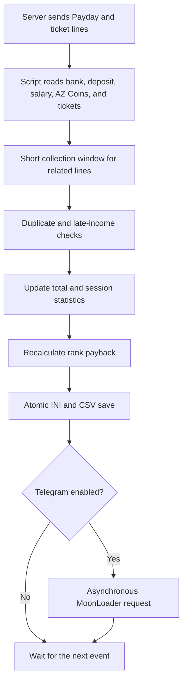

<div align="center">

# 💸 Arizona Payday Clean

### A MoonLoader script for automatic Payday, income, and rank payback tracking on Arizona RP

[](#)
[](#)
[](#)
[](#)

[Русский](README.md) · **English**

</div>

> [!NOTE]
> Some of the most useful projects do not begin with the desire to build something huge. They begin with the desire to stop repeating the same task every day.

---

## 📌 About the project

**Arizona Payday Clean** is a free MoonLoader script for Arizona RP that:

- automatically reads Payday data;
- keeps total statistics and a CSV history;
- calculates the payback of a purchased organization rank;
- tracks bank, deposit, AZ Coins, and AZ Coin tickets;
- detects the salary multiplier;
- sends reports and responds to Telegram bot commands;
- sends a fresh GTA screenshot to Telegram with `/screen`;
- restores statistics from backups;
- checks GitHub Releases for updates safely;
- keeps working while GTA is minimized;
- reduces background CPU usage and shuts down correctly with the game.

| Parameter | Value |
|---|---|
| **Author** | Artty |
| **Version** | 2.0.26 |
| **Platform** | MoonLoader / SA:MP / Arizona RP |
| **Distribution** | Free |
| **Main file** | `ArizonaPaydayClean.lua` |
| **Configuration** | `moonloader/config/ArizonaPaydayClean.ini` |
| **History** | `moonloader/config/ArizonaPaydayHistory.csv` |
| **Lua file encoding** | CP1251 |

---

<details open>
<summary><strong>👤 A note from the author</strong></summary>

<br>

Hello.

This project was never intended to be a “perfect” MoonLoader script with complex animations or hundreds of settings.

It was originally created for one person — me.

I wanted the script to do its job reliably: track Payday, preserve the data, and require as little attention as possible. Functionality matters more here than visual effects.

The repository is published for free as an example of my approach to automation, Telegram integrations, and practical problem solving.

</details>

---

## 🎯 Why this project exists

I spend much less time in the game than I used to. There is work, family, training, and everyday life.

My gameplay often looks like this:

```text
Buy a rank → start the game → minimize the window → leave the character AFK
```

I wanted to know:

- how much had already been earned;
- whether the rank had paid for itself;
- how much remained until full payback;
- which salary multiplier was active;
- how much deposit income was received;
- how many AZ Coins and tickets were received;
- what happened in the game without opening its window.

That is how **Arizona Payday Clean** appeared.

---

## ✨ Features

<table>
<tr>
<td width="50%" valign="top">

### 📊 Statistics

- automatic Payday detection;
- bank and deposit balances;
- salary from the latest Payday;
- deposit income;
- AZ Coins and AZ Coin tickets;
- total Payday count;
- total income;
- current session statistics;
- history in `ArizonaPaydayHistory.csv`;
- duplicate protection;
- recovery from backups.

</td>
<td width="50%" valign="top">

### 📈 Rank payback

- purchased rank number and price;
- base x1 salary;
- automatic multiplier detection;
- optional deposit income accounting;
- repaid and remaining amounts;
- remaining Payday count;
- estimated payback time;
- compact progress overlay.

</td>
</tr>
<tr>
<td width="50%" valign="top">

### 🖥 Interface

- `mimgui` main window;
- compact mini overlay;
- statistics, rank, Telegram, analytics, and update tabs;
- persistent settings;
- text-based inputs for large in-game values;
- minimized-game operation;
- adaptive background loop frequency.

</td>
<td width="50%" valign="top">

### 📬 Telegram

- automatic report after Payday;
- test message;
- notification toggle;
- `/status`, `/stats`, `/today`, `/screen`, `/rank`, `/history`, and other commands;
- access limited to the saved `chat_id`;
- asynchronous request queue;
- time-limited polling;
- stale callback protection;
- remote GTA screenshot with `/screen`;
- no `curl.exe`, PowerShell, CMD, or other external processes.

</td>
</tr>
</table>

---

## 🚑 What is new in version 2.0.26

Version **2.0.26** adds remote GTA screenshots through Telegram without changing the existing Payday accounting flow.

### Added

- Telegram bot command `/screen` — creates a fresh GTA screenshot and sends it to the saved chat;
- in-game command `/payscreen` — manually tests the same feature;
- automatic detection of a new PNG file in standard SA:MP screenshot folders;
- one screenshot job at a time;
- clear errors for an unsupported SA:MP build, a missing file, a timeout, or a Telegram failure;
- `/paytgcommands` now adds `/screen` to the Telegram bot command menu.

### Isolation and stability

- screenshot creation and photo upload are isolated in `ArizonaPaydayScreen.dll`;
- photo upload runs separately and does not block the game;
- existing text delivery, bot polling, and the updater were not rewritten;
- if the DLL is missing or blocked, only `/screen` is unavailable — Payday tracking, CSV, INI, Telegram reports, rank payback, and UI continue to work;
- on `/q`, the script requests cancellation and never waits for the network task;
- `curl.exe`, PowerShell, CMD, BAT files, and `CreateProcessA` are not used;
- the v2.0.25 financial parser protection against fake player chat messages remains enabled.

> [!IMPORTANT]
> `/screen` requires **both files**: `moonloader/ArizonaPaydayClean.lua` and `moonloader/lib/ArizonaPaydayScreen.dll`. Installing only the Lua file does not break the core script, but screenshot delivery will be unavailable.

> [!NOTE]
> Some GTA/SA:MP builds cannot create a screenshot while the window is fully minimized or the graphics device is lost. In that case the bot returns an error and statistics remain unchanged.

---

## 🕘 Previous version highlights

<details>
<summary><strong>Version 2.0.25 — stability, /q shutdown, and chat protection</strong></summary>

<br>

- reduced background workload while the game is active or minimized;
- shorter Telegram polling timeouts and a lower polling frequency;
- one safe shutdown path for `/q` and MoonLoader termination;
- new requests stop, queues are cleared, and settings are saved during shutdown;
- duplicate configuration saves were removed;
- player messages matching `Nick_Name[ID]: text` can no longer fake bank, deposit, AZ Coins, salary, or ticket lines;
- genuine system Payday lines still use the previous parser logic.

</details>

<details>
<summary><strong>Version 2.0.21 — Payday parser</strong></summary>

<br>

- fixed real bank and deposit lines containing formatted values;
- parser no longer depends on the exact `$` position or spacing;
- added support for `[HH:MM:SS]` prefixes;
- fixed the total salary line;
- improved AZ Coin ticket recognition;
- unknown values are no longer replaced with old data in Telegram;
- a partial report is not created from one unrelated line.

</details>

<details>
<summary><strong>Versions 2.0.19–2.0.20 — tickets, duplicates, and background work</strong></summary>

<br>

- strict parsing of ticket gain after `+`;
- ticket balance is read from `(N pcs.)`;
- AZ Coins are not mixed with tickets;
- Chat, GameText, and TextDraw notifications are merged;
- late income values are appended to the latest Payday;
- a single bank line does not create an empty Payday;
- adaptive background delay was introduced;
- mini-overlay calculations are cached.

</details>

---

## 📱 Telegram report contents

A Payday notification may include:

```text
💰 Salary
⚡ Detected multiplier
🏦 Deposit income
📊 Total Payday income
💳 Current bank balance
🏧 Current deposit balance
🪙 AZ Coins balance
🎟 Received AZ Coin tickets
📈 Rank payback progress
⏳ Remaining amount and Payday count
🕒 Time of the latest server line
```

---

## 🚀 Installation

### Requirements

- GTA San Andreas;
- SA:MP or a compatible Arizona RP client;
- MoonLoader;
- `mimgui`;
- `lib.samp.events`;
- `inicfg`;
- standard MoonLoader libraries;

### Install or update

1. Fully close GTA.
2. Open the complete v2.0.26 archive.
3. Copy:

```text
ArizonaPaydayClean.lua → moonloader/ArizonaPaydayClean.lua
```

4. Copy the screenshot module:

```text
lib/ArizonaPaydayScreen.dll → moonloader/lib/ArizonaPaydayScreen.dll
```

5. Keep only one active `ArizonaPaydayClean.lua` in `moonloader`.
6. Do not delete:

```text
moonloader/config/ArizonaPaydayClean.ini
moonloader/config/ArizonaPaydayHistory.csv
```

7. Start the game and verify the core script with `/payday`.
8. Test the new feature with `/payscreen`, then send `/screen` to the Telegram bot.

> [!IMPORTANT]
> The built-in `/payupdate` updates the Lua file. Install `ArizonaPaydayScreen.dll` manually at least once from the complete v2.0.26 archive.

> [!CAUTION]
> Two copies of the script may process the same Payday, duplicate Telegram reports, and increase CPU usage.

---

## ⌨️ In-game commands

| Command | Purpose |
|---|---|
| `/payday` | Open or close the main window |
| `/paycalc` | Alternative main window command |
| `/paystats` | Show current session statistics |
| `/payhistory` | Show recent Payday records |
| `/payrecover` | Recover data from backups and CSV |
| `/paydebug` | Toggle the diagnostic log |
| `/paywatch` | Toggle missed-Payday monitoring |
| `/paymini` | Show or hide the mini overlay |
| `/paymini on` / `/paymini off` | Set the mini-overlay state explicitly |
| `/payscreen` | Create a GTA screenshot and send it to the configured Telegram chat |
| `/paytg TOKEN CHAT_ID` | Save the Telegram token and chat ID |
| `/paytgtest` | Send a test report |
| `/paytgon` | Enable Telegram notifications |
| `/paytgoff` | Disable Telegram notifications |
| `/paybot` | Enable or disable Telegram bot commands |
| `/paytgcommands` | Refresh the Telegram command menu |
| `/payupdate` | Check for and install an update |
| `/payupdate rollback` | Restore the previous Lua version |

### Telegram setup example

```text
/paytg 1234567890:AAExampleBotTokenExample 123456789
```

A group or channel `chat_id` may be negative:

```text
/paytg 1234567890:AAExampleBotTokenExample -1001234567890
```

> [!CAUTION]
> Never publish a real bot token in Issues, screenshots, logs, or a public repository.

---

## 🤖 Telegram bot commands

| Command | Purpose |
|---|---|
| `/start` / `/help` | Help |
| `/status` / `/ping` | Game, Payday, and server activity status |
| `/stats` | Total statistics |
| `/today` | Statistics for the current date |
| `/screen` | Create a fresh GTA screenshot and send it to the chat |
| `/rank` | Rank payback |
| `/history N` | Recent Payday records |
| `/watch` | Missed-Payday monitor status |
| `/settings` | Current toggles |
| `/version` | Installed version |

Remote character control through Telegram is not implemented.

The bot token and `chat_id` are not embedded in the public Lua file. They are stored locally in:

```text
moonloader/config/ArizonaPaydayClean.ini
```

Recommended `.gitignore`:

```gitignore
**/ArizonaPaydayClean.ini
**/ArizonaPaydayTelegramResponse_*.json
**/ArizonaPaydayTelegramUpdates_*.json
moonloader.log
```

---

## 🧩 How it works



---

## 🛠 Technical decisions

### No external processes

The script does not launch:

- `curl.exe`;
- PowerShell;
- CMD;
- BAT files;
- `CreateProcessA`.

Text Telegram messages and updates still use MoonLoader's built-in asynchronous downloader:

```lua
downloadUrlToFile(...)
```

`ArizonaPaydayScreen.dll` handles photo delivery. It is stored in the `lib` folder and only needs to be installed once with the update.

### Isolated screenshot module

The module does not store the bot token or `chat_id`; it receives them only for one upload job. A missing DLL, load failure, or rejected photo changes only the current `/screen` request and never modifies financial statistics.

### Duplicate protection

The server may send related information through Chat, GameText, and TextDraw. The script combines those events within a short collection window, checks signatures, and appends late values to the existing Payday record.

### Large values

Values that may exceed a standard 32-bit `InputInt` range are entered as text and then converted safely to Lua numbers.

### Safe shutdown

Version 2.0.26 handles multiple MoonLoader termination events. Once shutdown begins, the script closes the menu, stops new requests, cancels the screenshot job without waiting, unlocks controls, and saves the current state without duplicate writes.

---

## 🐞 Reporting a problem

The script was primarily created for personal use, so compatibility with every MoonLoader build or third-party script cannot be guaranteed.

When opening an **Issue**, include:

- what happened;
- which action triggered it;
- whether GTA was minimized;
- whether anti-AFK was enabled;
- whether Telegram notifications and bot commands were enabled;
- whether `/screen` was used and a new PNG appeared in the SA:MP folder;
- which other MoonLoader scripts were running;
- the latest lines from `moonloader.log`;
- an example of a server message parsed incorrectly.

MoonLoader log:

```text
moonloader/moonloader.log
```

When `gta_sa.exe` freezes or closes without a Lua error:

```text
Windows Event Viewer → Windows Logs → Application
```

---

## 🔐 Security

Before publishing files, make sure you are not uploading:

- `ArizonaPaydayClean.ini`;
- `moonloader.log`;
- screenshots containing a bot token;
- temporary Telegram JSON responses;
- the entire `moonloader/config` directory.

The public `ArizonaPaydayClean.lua` contains no bot token or `chat_id`.

---

## 📦 GitHub Release v2.0.26

```text
Tag: v2.0.26
Name: Arizona Payday Clean v2.0.26 — Telegram Screenshot
Main file: ArizonaPaydayClean.lua
Module: lib/ArizonaPaydayScreen.dll
Ready archive: ArizonaPaydayClean-v2.0.26.zip
```

File verification:

```text
ArizonaPaydayClean.lua
Size: 201861 bytes
SHA-256: 95cde9866b0780f65d7e65c3c176ab130bdc9dedeca0485fb2323ab823469184
Encoding: CP1251

ArizonaPaydayScreen.dll
Size: 10240 bytes
SHA-256: 5c3186cf2d5fc30c8de6e2ac6eaf6897b5eb7010bb58c603d86f63d6d0af0c87
```


---

## 📄 License

The project is distributed free of charge.

You may use, study, and modify it. When publishing a modified build, keeping credit to the original author is appreciated.

---

## ❤️ Thanks

Thanks to my family, friends, and everyone who has been around.

SA:MP once taught me how to communicate with different people, negotiate, make decisions, and take responsibility. Those skills became useful far beyond the game.

> A person can leave Arizona RP. But Arizona RP probably never completely leaves the person.

<div align="center">

### Take care, and good luck with everything you do.

**Artty**

</div>
