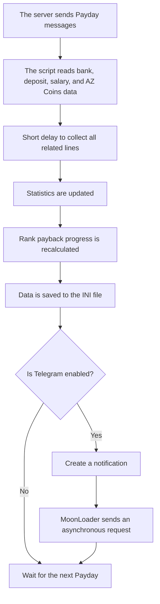

<div align="center">

# 💸 Arizona Payday Clean

### A MoonLoader script for automatic Payday tracking, income statistics, and rank payback calculation on Arizona RP

[](https://github.com/artyom129/Arizona-Payday-Clean)
[](https://github.com/artyom129/Arizona-Payday-Clean/releases/latest)
[](#)
[](https://github.com/artyom129/Arizona-Payday-Clean)

[Русская версия](README.md) · **English**

<br>

[](https://github.com/artyom129/Arizona-Payday-Clean/releases/latest)

</div>

> [!NOTE]
> Sometimes the most useful projects are born not from the desire to build something big, but from the desire to stop doing the same thing every day.

---

## 📌 About the Project

**Arizona Payday Clean** is a free MoonLoader script for Arizona RP that:

- automatically reads Payday data;
- keeps income statistics;
- calculates purchased-rank payback progress;
- tracks bank balance, deposit, and AZ Coins;
- sends reports to Telegram;
- continues working while the game is minimized.

| Parameter | Value |
|---|---|
| **Author** | Artty |
| **Version** | 2.0.12 |
| **Platform** | MoonLoader / SA:MP / Arizona RP |
| **Distribution** | Free |
| **Main file** | `ArizonaPaydayClean.lua` |
| **Configuration** | `moonloader/config/ArizonaPaydayClean.ini` |

---

<details open>
<summary><strong>👤 A Few Words from the Author</strong></summary>

<br>

Hi.

If you opened this repository, you were probably interested either in the script itself or in my GitHub profile.

There is one thing I want to make clear right away.

This project was never meant to be a “perfect” MoonLoader script designed to impress people with a beautiful interface, unusual animations, or a huge number of settings. Its goal was never to impress anyone with its design.

It was created for one person — me.

I wanted the script to simply work. Nothing unnecessary. Stable. It had to do what it was written for and not require constant attention.

Because of that, some parts of the code may look simple, some parts may not be the most elegant, and the interface may seem ordinary. That was a deliberate choice. Functionality has always mattered more to me than a pretty picture.

</details>

---

## 🎯 Why This Project Exists

I no longer spend as much time in the game as I once did.

Work takes up most of the day. I train. There is an ordinary life outside the game that deserves attention.

Because of that, my gameplay is fairly boring:

```text
Buy a rank → launch the game → minimize the window → leave the character AFK
```

After some time, I wanted to know:

- how much I had already earned;
- whether the rank had paid for itself;
- how much was left until full payback;
- what salary multiplier was applied;
- how much money came from the deposit;
- how many AZ Coins were received;
- and to receive all of this directly in Telegram without restoring the game window.

That is how **Arizona Payday Clean** appeared.

---

## ✨ Features

<table>
<tr>
<td width="50%" valign="top">

### 📊 Statistics and History

- automatic Payday detection;
- bank, deposit, and latest income;
- lifetime statistics;
- current-session analytics;
- average income per Payday;
- recent records in the interface;
- full log in `ArizonaPaydayHistory.csv`.

</td>
<td width="50%" valign="top">

### 📈 Payback Calculation

- purchased-rank price;
- x1 salary;
- multiplier detection;
- optional deposit inclusion;
- repaid and remaining amounts;
- Payday and time forecasts;
- movable in-game mini window with a saved position;
- confirmation before progress reset.

</td>
</tr>
<tr>
<td width="50%" valign="top">

### 🪙 AZ Coins

- regular AZ Coins tracking;
- separate AZ Coins ticket tracking;
- VIP tickets are not mixed with the donation balance;
- values are stored in history and Telegram reports.

</td>
<td width="50%" valign="top">

### 📬 Telegram and Monitoring

- premium HTML notifications;
- smooth payback progress bar;
- asynchronous request queue;
- complete `/paytgtest` preview;
- missed-Payday monitoring;
- diagnostic log without external processes.

</td>
</tr>
</table>

---

## 🆕 What Is New in Version 2.0.12

- fixed the floating mini window: it can now be moved instead of being locked to one position;
- added a dedicated move mode with a visible cursor and a **Done** button;
- the mini-window position is saved in the INI file and restored after restart;
- the saved position is clamped to the screen after a resolution change;
- in passive mode, the mini window no longer intercepts mouse and keyboard input;
- added `/paymini`, `/paymini reset`, `/paymini on`, and `/paymini off`;
- fixed the fallback ticket-balance calculation that previously could not be reached;
- strengthened duplicate protection across chat, GameText, TextDraw, and dialogs;
- interface labels and version messages now use the actual `SCRIPT_VERSION` value.

## Included in Version 2.0.11

- completely reworked the **`Ticket: +N AZ Coins`** item parser;
- supports the real server message `Вам был добавлен предмет Талон: +1 AZ Coins (3 шт.)`;
- reads the gained amount after `+` and the current ticket balance from `(N шт.)`;
- added a fallback parser for future server wording changes;
- duplicated messages are ignored without dropping consecutive real tickets;
- the in-game chat confirms every successfully counted ticket;
- fixed last-server-message time in `/status`;
- retained the simplified Telegram commands and safe updater.

## Included in Version 2.0.1

- added two-way Telegram bot commands through `getUpdates`;
- the bot now responds to `/status`, `/stats`, `/today`, `/rank`, `/history`, `/watch`, and other commands;
- added remote switches for Payday monitoring and automatic notifications;
- the command list is registered automatically through `setMyCommands`;
- the command menu is scoped to the saved `chat_id`;
- messages from other chats are ignored;
- command replies work even when automatic Payday notifications are disabled;
- added the in-game commands `/paybot` and `/paytgcommands`;
- added a built-in JSON decoder with no new dependencies;
- persisted `update_offset` prevents duplicate command execution;
- stale pending updates are discarded safely on first startup;
- command handlers are protected with `pcall` so a response error cannot close the game;
- added `retry_after`, timeout, and webhook-conflict handling;
- temporary `ArizonaPaydayTelegramUpdates_*.json` files are removed after completion, timeout, and script shutdown;
- history text is HTML-escaped before being sent;
- polling now uses long polling to reduce request frequency.

## What Was Included in Version 2.0.0

- added the **Analytics** tab;
- added current-session time, Payday, income, AZ, and ticket statistics;
- added Payday history in `moonloader/config/ArizonaPaydayHistory.csv`;
- regular AZ Coins and AZ Coins ticket items are tracked separately;
- added `/paystats` and `/payhistory`;
- added missed-Payday monitoring with an optional Telegram alert;
- added `/paydebug` diagnostics;
- added 1.7 configuration migration with an automatic backup;
- statistics and payback resets now require a second confirmation;
- fixed Telegram setting synchronization between `/paytg` and the UI;
- fixed nested Telegram HTML formatting;
- added cleanup for late Telegram response files;
- retained the tested 1.7 fixes for minimized-game operation, regular AZ Coins, and cursor flickering.

## 📱 Telegram Notification Contents

After Payday, the script sends a formatted report:

```text
💎 ARIZONA PAYDAY
━━━━━━━━━━━━━━━━━━
✅ Payment received

💰 INCOME
├ Salary: $ 301.515
├ Deposit: $ 229.748
├ Bonus: x1
└ Total: $ 531.263

🏦 BALANCE
├ Bank: $ 15.618.556
├ Deposit: $ 269.659.328
└ AZ Coins: 3.664  +2 AZ

📈 RANK №8
3.3%  •  Getting started
▍░░░░░░░░░░░░░
├ Repaid: $ ...
├ Remaining: $ 241.859.093
├ x1 forecast: 803 Paydays
└ Current-income forecast: 803 Paydays
⌛ Approximately: 16 d. 17 h.
```

---

## 🚀 Installation

### Requirements

- GTA San Andreas;
- SA:MP or a compatible Arizona RP build;
- MoonLoader;
- `mimgui`;
- `lib.samp.events`;
- `inicfg`;
- standard MoonLoader libraries.

### Clean Installation

1. Open the [latest Release](https://github.com/artyom129/Arizona-Payday-Clean/releases/latest).
2. Download the single `ArizonaPaydayClean.lua` file.
3. Keep only **one** script version in `moonloader`.
4. Place the file in:

```text
moonloader
```

5. Launch the game and run `/payday`.

### Updating from 1.7

1. Close the game completely.
2. Remove the old Lua file, but **do not delete** `ArizonaPaydayClean.ini`.
3. Place the new version in `moonloader`.
4. On first launch, the script creates:

```text
moonloader/config/ArizonaPaydayClean_v1_backup.ini
```

Telegram settings, statistics, and payback progress are preserved.

> [!IMPORTANT]
> Do not keep 1.7 and 2.0 together: both scripts may process the same Payday and register the same commands.

---

## ⌨️ Commands

| Command | Purpose |
|---|---|
| `/payday` | Open or close the main window |
| `/paycalc` | Alternative command for opening the window |
| `/paystats` | Show current-session statistics |
| `/payhistory` | Show recent Payday records in game chat |
| `/paywatch` | Enable or disable missed-Payday monitoring |
| `/paydebug` | Enable or disable the diagnostic log |
| `/paymini` | Enable or disable mini-window move mode |
| `/paymini reset` | Reset the mini window to its default position |
| `/payupdate` | Check whether a newer release is available |
| `/paytg TOKEN CHAT_ID` | Save the Telegram token and chat ID, then enable notifications |
| `/paytgtest` | Send a complete Telegram preview |
| `/paytgon` | Enable Telegram notifications |
| `/paytgoff` | Disable Telegram notifications |
| `/paybot` | Enable or disable incoming Telegram commands |
| `/paytgcommands` | Register the bot command menu again |

`/payafk` remains as a compatibility alias for `/paywatch` from the beta build.

### Setup Example

```text
/paytg 1234567890:AAExampleBotTokenExample 123456789
```

For a group or channel, `chat_id` may be negative:

```text
/paytg 1234567890:AAExampleBotTokenExample -1001234567890
```

> [!CAUTION]
> Never publish your real bot token in Issues, screenshots, logs, or a public repository.

---

## 🤖 Telegram Setup

1. Create a bot through **BotFather**.
2. Copy the bot token.
3. Send any message to the newly created bot.
4. Find your `chat_id`.
5. In the game, run:

```text
/paytg TOKEN CHAT_ID
```

6. Test the connection:

```text
/paytgtest
```

7. Open the bot chat. The command menu should appear beside the input field within a few seconds.

### Commands Inside Telegram

| Bot command | Action |
|---|---|
| `/start` or `/help` | Show command help |
| `/status` | Show script, last-Payday, and server-activity status |
| `/stats` | Show all-time statistics |
| `/today` | Show income and AZ for the current date |
| `/rank` | Show current rank payback progress |
| `/history 5` | Show between 1 and 10 recent Paydays |
| `/watch` | Show Payday monitoring status |
| `/watch_on` | Enable Payday monitoring |
| `/watch_off` | Disable Payday monitoring |
| `/notify_on` | Enable automatic post-Payday reports |
| `/notify_off` | Disable automatic reports without disabling bot commands |
| `/test` | Send a complete test Payday report |
| `/version` | Show the script version |

> [!IMPORTANT]
> The script executes commands only from the `chat_id` saved in its settings. Updates from other chats are acknowledged through `update_offset`, but are ignored and receive no reply.

> [!NOTE]
> Telegram Bot API does not allow `getUpdates` while a webhook is configured. If a conflict is detected, the script shows a warning in game; remove the webhook from the service that installed it.

### Where Telegram Data Is Stored

The bot token and `chat_id` are **not hardcoded into the Lua file**.

They are stored only locally in:

```text
moonloader/config/ArizonaPaydayClean.ini
```

Recommended `.gitignore`:

```gitignore
**/ArizonaPaydayClean.ini
**/ArizonaPaydayTelegramResponse_*.json
**/ArizonaPaydayTelegramUpdates_*.json
moonloader.log
```

---

## 🗂 Local Files in 2.0

| File | Purpose |
|---|---|
| `ArizonaPaydayClean.ini` | Settings and main statistics |
| `ArizonaPaydayClean_v1_backup.ini` | Backup created before migration from 1.x |
| `ArizonaPaydayHistory.csv` | Payday history for viewing and analysis |
| `ArizonaPaydayTelegramResponse_*.json` | Temporary send-response file; removed automatically |
| `ArizonaPaydayTelegramUpdates_*.json` | Temporary `getUpdates` response; removed automatically |
| `ArizonaPaydayDebug.log` | Diagnostics created while `/paydebug` is enabled |

> [!NOTE]
> Payday monitoring is not an anti-AFK system. It does not move the character, press keys, or reconnect. It only warns when the next Payday is not detected after the first captured Payday.

---

## 🧩 How the Script Works



---

## 🛠 Development Challenges

<details>
<summary><strong>1. The Game Crashed While Minimized</strong></summary>

<br>

The most unpleasant issue appeared during Telegram notification development.

The first implementation launched `curl.exe` from MoonLoader. A later version launched an external process through the Windows API using `CreateProcessA`.

This could work while the game window was active, but the combination of:

- a minimized GTA window;
- an active anti-AFK script;
- receiving Payday;
- launching an external process;
- waiting for a network response;

could cause the game to close completely without a normal Lua error in `moonloader.log`.

Eventually, all external process execution had to be removed.

The current version uses MoonLoader’s built-in asynchronous downloader:

```lua
downloadUrlToFile(...)
```

The script now:

- does not launch `curl.exe`;
- does not launch PowerShell;
- does not create BAT files;
- does not use CMD;
- does not call `CreateProcessA`;
- does not block the game thread;
- continues working while the game is minimized.

</details>

<details>
<summary><strong>2. Telegram and Russian Text</strong></summary>

<br>

The game and many SA:MP components use CP1251, while Telegram expects UTF-8.

Because of that, the script had to handle:

- UTF-8 conversion;
- URL encoding;
- line breaks;
- special characters;
- Telegram API responses.

Without this processing, Russian text could arrive corrupted or the request could be rejected.

</details>

<details>
<summary><strong>3. Processing the Same Payday More Than Once</strong></summary>

<br>

The server may send several bank-receipt lines one after another.

If every line is treated as a separate Payday, statistics increase multiple times. If processing finishes too early, data such as deposit income or AZ Coins may not have arrived yet.

The script uses delayed finalization and duplicate protection.

</details>

<details>
<summary><strong>4. Different Server Message Wording</strong></summary>

<br>

The same information may appear in different wording:

- “Current bank balance”;
- “Bank balance”;
- “Bank account”.

The script checks several possible variants. If the server completely changes the Payday format, the handlers will need to be updated.

</details>

<details>
<summary><strong>5. Large In-Game Values</strong></summary>

<br>

Some values may exceed the range of a standard 32-bit integer.

For this reason, selected fields are processed as strings and Lua numbers instead of relying only on the standard `InputInt`.

</details>

<details>
<summary><strong>6. Telegram Request Queue</strong></summary>

<br>

If an older request hangs, times out, or its callback arrives too late, it could affect the next request.

Each request now receives its own identifier, and stale responses are ignored.

</details>

<details>
<summary><strong>7. Compatibility with Other Scripts</strong></summary>

<br>

Other MoonLoader scripts may:

- modify `samp.events`;
- interfere with the pause state;
- change cursor behavior;
- use their own anti-AFK logic;
- intercept server messages.

Absolute compatibility with every possible setup cannot be guaranteed.

</details>

---

## 🐞 Possible Issues

The script was originally created for personal use, so bugs or unfinished parts may still remain.

When creating an **Issue**, please include:

- what happened;
- what you did before the issue appeared;
- whether the game was minimized;
- whether anti-AFK was enabled;
- whether Telegram notifications were enabled;
- which other MoonLoader scripts were active;
- the latest lines from `moonloader.log`;
- an example of the server message that was processed incorrectly.

### Log Location

```text
moonloader/moonloader.log
```

If `gta_sa.exe` crashes completely and no Lua error is written:

```text
Windows Event Viewer → Windows Logs → Application
```

---

## 🔐 Security

Before publishing or sending files, make sure you are not including:

- `ArizonaPaydayClean.ini`;
- `moonloader.log`;
- screenshots showing your bot token;
- temporary Telegram response files;
- an archive of the entire `moonloader/config` directory.

> [!TIP]
> The public Lua file does not contain the bot token or `chat_id`.

---

## 💬 Why GitHub?

This repository was not uploaded for advertising.

And definitely not because I expect thousands of players to use it.

Most Arizona RP players will probably never see it. I do not actively promote it, post it on forums, or distribute it elsewhere.

For me, this is simply one of the projects I decided to leave open.

My main area of work is process automation, Telegram bots, internal tools, and small services.

MoonLoader and SA:MP are a very different field, but I have always enjoyed learning new things. I do not like limiting myself to one technology or programming language. When an interesting task appears, I try to understand it and solve it.

That is why this repository is here — as one example of my approach to development.

---

## 🎮 What Does SA:MP Have to Do with It?

Probably because some things stay with a person much longer than expected.

For many people, SA:MP is just an old game.

For me, it was a small stage of life that taught me a lot.

A long time ago, I was a deputy leader and later the leader of an organization on a project that no longer exists today.

That was the first time I had to do more than simply play. I had to communicate with people, negotiate, resolve conflicts, make decisions, take responsibility, and lead a team.

Years later, I realized that these skills became useful far beyond the game.

That is probably why SA:MP still brings back warm memories.

Arizona RP itself has also been gradually moving away from classic SA:MP. New technologies, custom solutions, and its own direction of development — time keeps moving forward.

> A person can leave Arizona RP. But Arizona RP will probably never leave the person.

That is probably why I still sometimes want to open the game, join an organization, leave my character AFK, and simply hear the familiar sound of another Payday.

---

## 📄 License

This project is distributed completely free of charge.

Use it, study it, and modify it for your own needs if it turns out to be useful.

If you publish a modified version, it would be fair to keep a reference to the original author.

---

## ❤️ Thanks

Thank you to my friends and to the people who were with me during different periods of my life.

And special thanks to everyone whose path once crossed mine in SA:MP. Even if we have not played for a long time, some of those memories will stay with us forever.

<div align="center">

### Take care of yourself. And good luck with whatever you choose to do.

**Artty**

</div>
